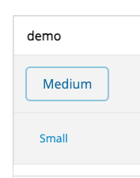

# 元件 API 比較 & 統整計畫
> web-prototype (wp) vs ui-library (ul)

## 零、元件盤點 & 對齊進度

> ✅ = 已透過 skill 對齊（token、props、bug fix、設計稿）
> ⚠️ = 部分修正，尚有待確認項目
> ❌ = 尚未對齊

| 元件 | 狀態 | 說明 |
|------|------|------|
| `button` | ✅ | token 替換、disabled/loading bug 修正、not-disabled:hover、shadow、success/warning variant、`@base-ui` primitive |
| `icon-button` | ✅ | token 替換、所有 variant 補齊、loading、shadow、focus ring、sm size、font-size 對齊設計稿 |
| `icon` | ✅ | 新建，iconfont 三套（440 icons），local 優先 CDN 備援 |
| `announcement` | ✅ | `style`→`variant`、補邊框、標題/內文色改 token、close 換 IconButton + Icon |
| `alert` | ✅ | ZeroHeight + Figma 對齊；@base-ui primitive、overlay 不可關閉、右對齊按鈕、responsive 寬度、token 色值 |
| `toast` | ❌ | 內部 action button 換成 `<Button>`、stateConfig 換 token，但尚未對照 ul / Figma / ZeroHeight 全面檢查 |
| `avatar` | ✅ | ZeroHeight + ul 對齊：5 色背景、full-name hash、大小寫保留、圖片錯誤 fallback |
| `avatar-group` | ✅ | ul 無此元件，純對照 ZeroHeight：匿名遮罩改 7 個星號、文字色換 token |
| `badge` | ✅ | `"error"`→`"danger"`、補 neutral 色、補 BadgeNew（新/N）、BadgeDot 補 ripple 動效、BadgeAnchor 補 placement prop、token 色值 |
| `checkbox` | ✅ | `@base-ui/react/checkbox`（Checkbox.Root + Checkbox.Indicator）、ARIA + Space key + indeterminate 由 primitive 管理、focus `focus-visible:ring-2` + named group `group/cb`、hover `group-hover/label:` |
| `chip` | ✅ | token 替換、× icon 改用 AsiaYo iconfont `times-circle`（捨棄自製 SVG）、focus ring `ring-2 ring-primary-6/48`、補 `disabled` prop |
| `date-range-picker` | ❌ | |
| `flash-notice` | ✅ | single-instance（新取代舊）、link 色換 `text-primary-6` token、固定寬（手機 220px / 桌機 280px）、padding p-4、左下角定位 16px、timer race condition 修正 |
| `input` | ✅ | token 替換、border→ring（no layout shift）、focus-within（含 click）、重命名 form-input→input |
| `form-textarea` | ✅ | token 替換、字數計 error 時改 `danger-6`、scrollbar 對齊 ul（6px / neutral-3 / neutral-5）、補 Firefox scrollbar、補 `autoHeight` prop |
| `nav-bar` | ❌ | ul 無對應元件 |
| `number-picker` | ✅ | 換用 `@base-ui/react/number-field`：中間改為真正 `<input>`（ZeroHeight 規格）、inputMode="numeric"、token 色值、完整 a11y |
| `page-header` | ❌ | ul 無對應元件 |
| `pagination` | ❌ | |
| `popover` | ❌ | ul 無對應元件 |
| `radio-button` | ✅ | `@base-ui/react/radio`（Radio.Root + Radio.Indicator）+ `@base-ui/react/radio-group`（RadioGroup）、arrow key 導覽由 primitive 管理、新增 `RadioGroup` export、API 改為 RadioGroup 管理 value |
| `rating-badge` | ❌ | |
| `switch` | ❌ | |
| `tabs` | ❌ | ul 無對應元件 |
| `tag` | ❌ | |
| `tooltip` | ❌ | |

**進度：16 個完成 / 10 個待處理**（共 26 個）

---

## 一、背景說明

wp 採用 shadcn + Tailwind + @base-ui/react 架構；ul 採用 styled-components。兩者目前各自維護，但未來預計共用同一套 API 規範，因此需要盤點差異並擬定統整方向。

**以 wp 的命名為標準**（`variant` / `appearance` / `sm|md|lg`），ul 日後跟進對齊。

---

## 二、Button / IconButton 完整狀態（含 ZeroHeight & Figma 對照）

### 2-1 Button — 目前 wp 實作

| 項目 | wp（當前） | ul | ZeroHeight / Figma |
|------|-----------|----|--------------------|
| 色系 prop | `variant: primary \| success \| warning \| danger \| neutral` | `level: primary \| success \| warning \| danger \| neutral \| tertiary \| dark \| ghost \| momo` | primary / success / warning / danger / neutral ✅ |
| 外觀 prop | `appearance: solid \| outline \| flat` | `styleType: solid \| outline \| flat` | solid / outline / flat ✅ |
| 形狀 prop | `shape: rounded \| pill` | `shape: rounded \| pill` | rounded / pill ✅ |
| 尺寸 prop | `size: sm \| md \| lg` | `size: small \| medium \| large \| response` | sm=32px / md=40px / lg=48px ✅ |
| neutral solid | 不存在（ZeroHeight 標示「—」） | 存在 | ✅ wp 正確 |
| Icon prop | `icon?: ReactNode` | `iconName / iconType / iconColor` | — |
| Loading | `loading: boolean` → `aria-busy` + LoadingDots | `loading: boolean` | ✅ |
| Loading opacity | loading 時 opacity 維持 100%（`aria-busy:opacity-100`） | loading 時 opacity = 1 | ✅ 一致 |
| Disabled | `disabled: boolean` → `cursor-not-allowed` + `opacity-0.48` | `disabled: boolean` | ✅ |
| Disabled hover | `not-disabled:hover:` 前綴，disabled 時不觸發 hover | 未特別處理 | ✅ wp 正確 |
| Shadow | `shadow?: boolean`（對 pill 有視覺效果） | `shadow?: boolean` | ✅ |
| Focus ring | `:focus-visible`（鍵盤才顯示） | `:focus`（滑鼠點擊也顯示） | ⚠️ 待 Design 確認（見第五節） |

**ul 獨有、wp 不實作的 variant：**

| ul variant | 對應方式 |
|-----------|---------|
| `tertiary` | → `neutral` + `appearance="outline"` |
| `dark` | → 視需求以 `className` 覆寫 |
| `ghost` | → 視需求以 `className` 覆寫 |
| `momo` | → 品牌專用，個別處理 |

---

### 2-2 IconButton — 目前 wp 實作

| 項目 | wp（當前） | ul | ZeroHeight / Figma |
|------|-----------|----|--------------------|
| 色系 prop | `variant: primary \| success \| warning \| danger \| neutral` | `level: primary \| success \| warning \| danger \| neutral \| tertiary \| dark \| ghost \| momo` | ✅ |
| 外觀 prop | `appearance: solid \| outline \| flat` | `styleType: solid \| outline \| flat` | ✅ |
| 形狀 prop | `shape: rounded \| circular` | `shape: rounded \| circular` | circular 用於 floating button，可加 shadow ✅ |
| 尺寸 prop | `size: sm(32) \| md(40) \| lg(48)` | `size: small(32) \| medium(40) \| large(48) \| response` | sm=icon-only group / md+lg=bg+icon group ✅ |
| Icon prop | `children: ReactNode` | `iconName / iconType / iconColor` | — |
| Loading | `loading: boolean` → `aria-busy` + LoadingDots（`size-1.5` 小點） | `loading: boolean` → LoadingDots（`isPureIcon=true`） | ✅ |
| Disabled hover | `not-disabled:hover:` 前綴 | 未特別處理 | ✅ wp 正確 |
| Shadow | `shadow?: boolean`（對 circular 有視覺效果） | `shadow?: boolean` | ✅ |
| Focus ring | `:focus-visible` | `:focus` | ⚠️ 待 Design 確認 |
| Flat hover bg | 使用 token（如 `primary-1`），與 outline hover bg 相同 | opacity overlay（`primary[5]29`，約 16% 透明） | ✅ **wp 正確**（Figma SVG 確認 flat 與 outline hover bg 相同） |
| success/warning solid | ✅ 已實作 | ✅ 已實作 | ✅ |
| success/warning outline | ✅ 已實作 | ✅ 已實作 | ✅ |
| 底層元件 | `@base-ui/react/button` | styled-components `<button>` | — |

---

## 二-三、Alert

### Alert — props 比較

| 項目 | wp | ul |
|------|----|----|
| 開關控制 | `open: boolean` + `onOpenChange`（controlled）| 無，直接 render（uncontrolled）|
| Title | `title?: string`（optional） | `title: string`（必填）|
| 內容 | `content: string`（單一字串） | `message?` + `details?: string[]` + `errorCode?` + `errorCodeTitle?` |
| 主要按鈕 | `primaryAction: { label, onClick }` | `actionMsg: string` + `actionHandler?` + `actionValue?` |
| 次要按鈕 | `dismissAction?: { label, onClick }` | `closeMsg?` + `closeHandler?` + `closeValue?` |
| 按鈕顏色 | `type: "normal" \| "destructive"` | `actionButtonLevel?: Level`（全色系可選）|
| 按鈕 disabled | 不支援（由 caller 控制） | `actionDisabled?: boolean` |
| Primitive | `@base-ui/react/alert-dialog`（Portal + focus trap + Escape） | `<Overlay>` 自家元件 |
| Overlay 關閉 | ❌ 不可（ZeroHeight 規定，@base-ui 預設） | ❌ 不可 |
| 寬度 | Web: `320px` / App: `calc(100vw-32px)` | 未定義 |
| 按鈕對齊 | 右對齊（Figma 確認） | 未定義 |

### Alert — 從 ul 遷移到 wp

**主要差異：**
1. 需要自己管 `open` state（ul 直接 render，wp 是 controlled）
2. `details[]` 需手動合併成一個字串傳給 `content`
3. 按鈕 props 改成物件格式
4. `actionButtonLevel` 簡化成 `type`（只有 normal / destructive 兩種）

```tsx
// ul
<Alert
  title="確認要取消訂單？"
  message="取消後無法復原。"
  details={["detail1", "detail2"]}
  actionMsg="確認"
  actionHandler={handleConfirm}
  closeMsg="返回"
  closeHandler={handleClose}
  actionButtonLevel="danger"
/>

// wp
const [open, setOpen] = useState(false)

<AlertDialog
  open={open}
  onOpenChange={setOpen}
  title="確認要取消訂單？"
  content="取消後無法復原。detail1 detail2"
  type="destructive"
  primaryAction={{ label: "確認", onClick: handleConfirm }}
  dismissAction={{ label: "返回", onClick: handleClose }}
/>
```

**⚠️ actionButtonLevel 對應表**

| ul `actionButtonLevel` | wp `type` |
|------------------------|-----------|
| `"primary"`（預設） | `"normal"`（預設）|
| `"danger"` | `"destructive"` |
| 其他（`"success"` 等） | 目前不支援，需客製化 |

---

## 三、其他元件 props 比較

### 3-0 Icon

| 項目 | wp | ul |
|------|----|----|
| 元件名稱 | `Icon` | `Icons` |
| `name` prop | 同（支援有無 `ay-icon-` prefix） | `name: string` |
| `type` prop | `"icons" \| "line" \| "solid"` | 同 |
| `type` 預設值 | `"line"` ⚠️ | `"icons"`（舊版字型集） |
| `size` prop | `number`（px） | 無，靠父層 font-size 控制 |
| `className` | ✅ | ✅ |
| `onClick` | ✅ | ✅ |
| `aria-label` | ✅（有傳時自動設 `role="img"`） | 無 |
| `aria-hidden` | 預設 `true`（無 label 時）| 無 |
| 渲染方式 | `<i>` + unicode char 直接 text content | styled-components `::before content` |
| 字型來源 | local `/public/fonts/icons/` 優先，CDN 備援 | 僅 CDN |
| 字型數量 | 268（icons）+ 96（line）+ 76（solid）= 440 | 同 |

**⚠️ 唯一刻意不對齊的地方：`type` 預設值**

ul 預設 `"icons"`（舊版 iconfont，268 個）；wp 改預設 `"line"`（新版 Web Icons Line，96 個）。
原因：新版 `line` / `solid` 是 AsiaYo 現行設計規範，`"icons"` 是舊有歷史包袱。
如果 ul 日後也跟進，改 `type` 預設即可，不影響傳了 `type` 的現有呼叫。

**字型本地化步驟**

```bash
mkdir -p public/fonts/icons
curl https://img.asiayo.com/static/icon/v1.0.24/Ay-Icons.woff            -o public/fonts/icons/Ay-Icons.woff
curl https://img.asiayo.com/static/icon/v1.0.24/Ay-Icons.ttf             -o public/fonts/icons/Ay-Icons.ttf
curl https://img.asiayo.com/static/icon/v1.0.24/Ay-Web-Icons-Line.woff   -o public/fonts/icons/Ay-Web-Icons-Line.woff
curl https://img.asiayo.com/static/icon/v1.0.24/Ay-Web-Icons-Line.ttf    -o public/fonts/icons/Ay-Web-Icons-Line.ttf
curl https://img.asiayo.com/static/icon/v1.0.24/Ay-Web-Icons-Solid.woff  -o public/fonts/icons/Ay-Web-Icons-Solid.woff
curl https://img.asiayo.com/static/icon/v1.0.24/Ay-Web-Icons-Solid.ttf   -o public/fonts/icons/Ay-Web-Icons-Solid.ttf
```

---

### 3-0 Badge

| 項目 | wp | ul |
|------|----|----|
| 色系 prop | `color: "danger" \| "primary" \| "neutral"` | `level: "danger" \| "primary" \| "neutral"` |
| 內容 prop | `value?: number \| string` | `content?: string \| number` |
| 無值時行為 | dot 模式 | 同（`hasContent` 控制） |
| 定位模式 | `placement: "at-edge" \| "close-edge"` | `position: "outside" \| "inside"` |
| 自訂偏移 | ❌ 不支援 | `offsetX, offsetY` |
| Anchor 寫法 | `<BadgeAnchor value={...}>` 分離元件 | `<Badge children={...}>` 合一 |
| 上限 cap | `max` prop（預設 99）| hardcode 99 |
| Ripple | `ripple` prop ✅ | `ripple` prop ✅ |
| hidden | `hidden` prop ✅ | ❌ 無 |

**ul → wp 遷移**

```tsx
// ul
<Badge level="primary" content={5} />
<Badge level="danger" content="新" />
<Badge level="danger" ripple>        {/* dot with ripple */}
  <SomeComponent />
</Badge>

// wp
<Badge value={5} color="primary" />
<Badge value="新" />                  {/* color 預設 danger */}
<BadgeAnchor ripple>                  {/* dot with ripple */}
  <SomeComponent />
</BadgeAnchor>
```

**⚠️ ul 有但 wp 不支援：**
- `offsetX / offsetY` — ul 可精確調整偏移量，wp 固定 8px（at-edge）或 4px（close-edge），如需客製請用 `className` 覆寫

---

### 3-1 Badge

| 項目 | wp | ul |
|------|----|----|
| 數字 badge | `count`, `max`（預設 99）, `color: error \| primary`, `hidden` | `content`, `level: primary \| danger \| neutral`, `position`, `offsetX`, `offsetY`, `ripple` |
| Dot badge | `color: error \| primary` | （同上 level） |
| Anchor | `BadgeAnchor: count \| dot, color, hidden, children` | （包裹在元件外層，用 offset 定位） |

### 3-2 Tag

| 項目 | wp | ul |
|------|----|----|
| 色系 prop | `variant: warm \| success \| warning \| danger \| gray \| navy \| black \| dark-overlay` | `type: primary \| warning \| danger \| neutral \| success` |
| 外觀 prop | variant 值隱含外觀（navy/black = solid） | `styleType: solid \| outline` |
| 尺寸 prop | `size: small \| medium \| large` | `size: small \| medium \| large` |
| FilterPill | `label, active, onClick` | （無對應元件） |
| SaleTag | `variant: solid \| outline`, `badge`, `description` | （無對應元件） |

### 3-3 Avatar

| 項目 | wp（對齊後） | ul | ZeroHeight |
|------|------------|----|--------------------|
| `name` | `name?: string`（optional，有 placeholder）| `name: string`（必填）| 顯示 first name 首字 |
| `src` | `src?: string` | `avatar?: string` | Image Avatar |
| 尺寸 | `32\|36\|40\|44\|48\|52\|56` | 同 | 7 種尺寸，每級差 4px ✅ |
| Font-size | ≤36→16px / 40/44→20px / ≥48→24px | 同 | ZeroHeight 確認 ✅ |
| 背景色數量 | **5 色**（ZeroHeight 明確「五種背景」）| 5 色 | ✅ |
| 背景色值 | `#6ccfeb / #ffd752 / #a0e09e / #055885 / #ff9b70`（對齊 ul cp-theme）| 同（primary[3]/warning[3]/success[3]/primary[7]/danger[3]）| ✅ |
| Hash 輸入 | 完整 `name` 字串 | 同 | ✅ |
| 大小寫 | 保留原始大小寫 | 同（`.charAt(0)`）| ZeroHeight：小寫應保留 ✅ |
| 圖片錯誤 fallback | `onError` → 退回 initials/placeholder | `useEffect` + `onerror` | ✅ |

**ul → wp 遷移：**
```tsx
// ul
<Avatar name="Alice" avatar="https://..." size={44} />

// wp
<Avatar name="Alice" src="https://..." size={44} />
```

唯一要改的就是 `avatar` → `src`。

### 3-4 Notification

| 元件 | wp | ul |
|------|----|-----|
| Toast | `state: primary \| warning \| error` / `title, body, actions[]` / `autoDismiss, dismissDuration` | `title, description` / `iconType, iconName` |
| FlashNotice | `title, body, link{label,href?,onClick?}, suffix` / `duration` | `title, content?: ReactNode, duration, refreshable` |
| Announcement | `variant: primary \| warning \| success` / `title, content` / `showCloseButton, onClose` | `type: warning \| primary \| success` / `title, content` / `rounded, closeButton, iconType, iconName` |

### 3-4a FlashNotice 詳細比較（已對齊）

| 項目 | wp（對齊後） | ul | ZeroHeight |
|------|------------|----|--------------------|
| API 風格 | 宣告式（`FlashNoticeProvider` + `useFlashNotice`）| 命令式（`notify(props)`） | 以 UX 行為為準 |
| `title` | `string`（必填） | `string`（必填） | ✅ |
| `body` | `string?`（純文字，出現在 title 下方） | `content?: ReactNode`（更彈性）| wp 刻意限縮為 string |
| `link` | `{label, href?, onClick?}?` | ❌ 無 | ✅ wp 額外支援（ZeroHeight 有規格）|
| `suffix` | `string?`（link 後的結尾文字，如「。」）| ❌ 無 | ✅ wp 額外支援 |
| `duration` | `number?`（預設 3000ms）| `number?`（預設 5000ms）| — |
| `refreshable` | ❌ 無（行為等同 refreshable=true） | `boolean?`（true = 新的取代舊的）| — |
| 同時顯示數量 | ✅ **一次只一個（新取代舊）** | ✅ 一次只一個（`refreshable` 控制）| ✅「不會產生推疊與重複」|
| Link 色 | ✅ `text-primary-6` token | N/A | ✅ |
| 寬度 | ✅ 手機 `220px`、桌機 `280px`（固定）| 手機 `220px`、桌機 `280px`（固定）| ✅ |
| Padding | ✅ `p-4`（四邊 16px）| `padding: 16px`（四邊）| ✅ |
| 定位 | ✅ `bottom-4 left-4`（16px）左下角 | `bottom: 16px; left: 16px`（左下角）| ✅ 左下角 |
| 動畫 | `flash-notice-in`（上滑 + fade in）| CSSTransition fade | — |

**⚠️ ul 有但 wp 不支援：**
- `content: ReactNode` — ul 允許 body 放入任意 ReactNode；wp 固定為 string + link 結構。如需富文字，請用 `className` 自行組合或提 PR。
- `refreshable` prop — wp 固定行為等同 `refreshable=true`（新通知永遠取代舊的）。

**⚠️ ZeroHeight Dos & Don'ts：**
- `link` 不可單獨使用，必須搭配 `body`。

**ul → wp 遷移：**

```tsx
// ul
notify({ title: "複製成功", duration: 3000 })
notify({ title: "成功", content: <span>已將旅宿加入收藏清單。</span>, refreshable: true })

// wp（在 FlashNoticeProvider 內）
const { show } = useFlashNotice()
show({ title: "複製成功", duration: 3000 })
show({ title: "成功", body: "已將旅宿加入收藏清單。" })
// link 用法（須搭配 body）
show({ title: "還差一步", body: "請先前往", link: { label: "登入", onClick: () => {} }, suffix: "完成收藏。" })
```

### 3-5 Form Components

| 元件 | wp | ul |
|------|----|-----|
| FormInput | `label`, `state: default\|error\|warning\|success\|disabled` / `feedback, helper` / `prefixIcon, suffixIcon: ReactNode` / `clearable, onClear` | `label`, `errors[]` / `prefixIcon`（icon name string）/ `clearable` |
| Checkbox | `checked, indeterminate, disabled` / `label, subLabel` / `onChange: (v: boolean) => void` ✅ | `label, checked, indeterminate, disabled` / `status: default\|focus\|error\|success\|warning\|disabled` / `message, labelSize` |
| RadioButton | `value（必填）, label, subLabel, disabled` / 必須在 `<RadioGroup>` 內使用 ✅ | `label, checked, disabled, size` / `allowChildVisible, onChange` |
| RadioGroup | `value, defaultValue, onValueChange, name, disabled` ✅（wp 新增） | ❌ 無對應容器 |
| Switch | `checked, defaultChecked` / `disabled, loading` / `onChange, aria-label` | `checked, disabled, loading` / `onClick` |
| FormTextarea | `label, state, feedback, helper` / `maxLength, showCount` | `label, value, rows, autoHeight` / `min, max, error` / `onChange, onBlur, onFocus` |

### 3-5a Checkbox 詳細比較（已對齊）

| 項目 | wp（對齊後） | ul | Figma |
|------|------------|----|----|
| Primitive | `@base-ui/react/checkbox`（Checkbox.Root + Checkbox.Indicator） | 純 styled-components CSS | — |
| `checked` | `boolean?`（預設 false） | `boolean?` | ✅ |
| `indeterminate` | `boolean?` | `boolean?` | ✅ |
| `disabled` | `boolean?` | `boolean?` | ✅ |
| `label` | `string?` | `ReactNode?` | wp 刻意限縮為 string |
| `subLabel` | `string?`（wp 獨有，12px，label 下方） | ❌ 無 | wp 新增 |
| `onChange` | `(checked: boolean) => void` | `(e: ChangeEvent) => void` | — |
| `id` / `name` | `string?` | ❌ 無 | — |
| ARIA | Checkbox.Root 自動管理 `role="checkbox"` / `aria-checked` / `aria-disabled` | CSS :checked 偽類 | — |
| 鍵盤 | Space 鍵切換（由 primitive 管理） | Space 透過 native input | ✅ |
| disabled unchecked | `bg-neutral-5` box，border `neutral-6` | `bg-neutral[4]` | ✅ |
| disabled checked/indet. | `opacity-[0.48]` | `bg-primary[2]` = primary-3 | ✅ Figma 規格 |
| hover（unchecked） | `group-hover/label:bg-primary-1` | `:active bg-primary[0]` | ✅ |
| focus ring | `focus-visible:ring-2 ring-primary-6/48` on Root span | `:focus-within border+shadow` | ✅ |
| focus border | `group-focus-visible/cb:border-primary-6` on inner box | — | ✅ |
| label disabled 色 | `text-neutral-6` | `color: neutral[5]` = neutral-6 | ✅ |

**⚠️ ul 有但 wp 不支援：**
- `status` / `message` — ul 支援表單驗證狀態，wp 留待 FormInput 元件統一處理
- `labelSize` — ul 有 small/medium/large；wp 固定 14px
- `children`（子內容）— ul checked 時可展開子內容；wp 無此需求
- `onChange` 簽名不同 — ul 回傳 `ChangeEvent`；wp 直接回傳 `boolean`

**ul → wp 遷移：**

```tsx
// ul
<Checkbox
  label={<span>接受條款</span>}
  checked={val}
  onChange={(e) => setVal(e.target.checked)}
  status="error"
  message="必須勾選"
/>

// wp
<Checkbox
  label="接受條款"
  checked={val}
  onChange={(checked) => setVal(checked)}
  // status/message 由外層 FormFeedback 處理
/>
```

### 3-5b RadioButton / RadioGroup 詳細比較（已對齊）

| 項目 | wp（對齊後） | ul | Figma |
|------|------------|----|----|
| Primitive | `@base-ui/react/radio` + `@base-ui/react/radio-group` | 純 styled-components CSS | — |
| 使用方式 | 必須在 `<RadioGroup>` 內使用 | 獨立使用（自帶 checked + onChange） | — |
| `value`（RadioButton） | `string`（必填） | 無對應（透過 checked 判斷） | — |
| `disabled` | `boolean?` | `boolean?` | ✅ |
| `label` / `subLabel` | `string?` | `label: ReactNode?` | wp 限縮為 string |
| RadioGroup `value` | `string?`（controlled） | ❌ 無容器 | — |
| RadioGroup `onValueChange` | `(value: string) => void` | 每個 RadioButton 各有 `onChange: (e: ChangeEvent) => void` | — |
| RadioGroup `name` | `string?` | 每個 RadioButton 各有 `name` | — |
| ARIA | Radio.Root 自動 `role="radio"` / `aria-checked` / `aria-disabled` | CSS :checked 偽類 | — |
| 鍵盤導覽 | Arrow key 在 RadioGroup 內切換（由 primitive 管理） | native input arrow key | ✅ |
| disabled unchecked | `bg-neutral-5` circle，border `neutral-6` | `bg-neutral[4]` | ✅ |
| disabled checked | `opacity-[0.48]`（Figma） | `border: 4px solid primary[2]` | ✅ Figma 規格 |
| hover（unchecked） | `group-hover/label:bg-primary-1` | `:active bg-primary[0]` | ✅ |
| focus ring | `focus-visible:ring-2 ring-primary-6/48` on Root span | `:focus-within box-shadow` | ✅ |

**⚠️ ul 有但 wp 不支援：**
- 獨立 RadioButton（不需 RadioGroup）— ul 可直接使用，wp 強制需要 RadioGroup
- `size` prop — ul 有 small/medium/large；wp 固定尺寸
- `allowChildVisible` / `children` — ul 支援子內容展開；wp 無

**ul → wp 遷移：**

```tsx
// ul（各 RadioButton 獨立管理）
<Radio label="選項 A" name="g" checked={v==="a"} onChange={(e) => setV("a")} />
<Radio label="選項 B" name="g" checked={v==="b"} onChange={(e) => setV("b")} />

// wp（RadioGroup 統一管理）
<RadioGroup value={v} onValueChange={setV} name="g">
  <RadioButton value="a" label="選項 A" />
  <RadioButton value="b" label="選項 B" />
</RadioGroup>
```

---

### 3-6 其他元件

| 元件 | wp | ul |
|------|----|-----|
| Tooltip | `content, side: top\|bottom` / `beak: center\|start\|end` / `textAlign, children` | `renderContent: ReactNode` / `placement` / `position: absolute\|fixed` |
| RatingBadge | `score, commentCount` / `showGrading, outOf` | `score, count, maxScore, minScore` / `size: small\|medium\|large` / `ratingLevels, showComment` |
| Pagination | `page, totalPages` / `onPageChange` / `resultsText` | `total, current, onChange` |
| DateRangePicker | （互動式，props 由內部管理） | `level, startAt, value, defaultValue` / `calendarRange, loading, disabledDates, onChange` |
| NumberPicker | `value, min, max, step, name, onChange, disabled, variant` | `value, min, max, step, name, onChange, onBlur, autoFormat, disabled`（ul 有對應元件，見下方說明）|
| Popover | `content, link, imageSrc` / `placement`（6 方向）/ `children` | （無對應元件） |
| NavBar / Tabs | `items[], activeId, onSelect` / `badge: boolean` / `showChevron, type: adaptive\|fixed` | （無對應元件） |

---

## 四、統整項目與建議

### 4-1 全域命名規範（Breaking Change）

| 元件 | 項目 | 現況差異 | 建議方向 |
|------|------|---------|---------|
| 全元件 | 色系 prop | ul 用 `level`，wp 用 `variant` | 統一為 `variant`；ul 先做 alias 過渡 |
| 全元件 | 外觀 prop | ul 用 `styleType`，wp 用 `appearance` | 統一為 `appearance` |
| 全元件 | 尺寸值 | ul 用 `small\|medium\|large\|response`，wp 用 `sm\|md\|lg` | 統一為 `sm\|md\|lg` |

### 4-2 Button / IconButton

| 元件 | 項目 | 狀態 |
|------|------|------|
| Button | `icon: ReactNode` 取代 `iconName/iconType/iconColor` | ul 待改 |
| Button | `shadow` prop | ✅ wp 已實作 |
| Button | loading 時 opacity 保持 100% | ✅ wp 已修正 |
| Button | disabled 時 hover 不觸發（`not-disabled:hover:`） | ✅ wp 已修正；ul 待對齊 |
| Button | `tertiary/dark/ghost/momo` variant | ul 獨有，wp 以 `className` 擴充取代 |
| IconButton | `children: ReactNode` 取代 icon name props | ul 待改 |
| IconButton | `sm` size（32px，icon-only group） | ✅ wp 已實作 |
| IconButton | `success/warning solid/outline` | ✅ wp 已實作 |
| IconButton | flat hover bg 用 token（與 outline 相同） | ✅ wp 正確；ul 的 opacity 寫法與 Figma spec 有落差 |

### 4-3 Badge

| 元件 | 項目 | 建議方向 |
|------|------|---------|
| Badge | `color: primary\|error` → `variant: primary \| error \| neutral` | 統一為 `variant` |
| Badge | Anchor 包裹寫法 | 以 wp 的 `BadgeAnchor` 為準 |

### 4-4 Tag

| 元件 | 項目 | 建議方向 |
|------|------|---------|
| Tag | `type` → `variant` | 統一為 `variant` |
| Tag | 外觀隱含在 variant 值 → 拆出 `appearance: solid\|outline` | 更明確 |
| FilterPill / SaleTag | ul 無對應 | ul 補上 |

### 4-5 Notification

| 元件 | 項目 | 建議方向 |
|------|------|---------|
| Toast | ul 缺 `state` prop | ul 補上 |
| Announcement | `style` / `type` → `variant` | 統一為 `variant` |
| Announcement | `showCloseButton + onClose` vs `closeButton` | 統一為 `onClose?: () => void` |

### 4-6 Form

| 元件 | 項目 | 建議方向 |
|------|------|---------|
| FormInput | ul 缺 `state` prop | ul 補上 |
| FormInput | icon name string → `prefixIcon / suffixIcon: ReactNode` | 統一 |
| Checkbox | ul 的 `status` → `state` | 對齊 |
| RadioButton | `onChange: (value: string) => void` | 統一 |
| Switch | `onClick` → `onChange: (checked: boolean) => void` | 統一 |

---

## 五、執行優先度

| 優先度 | 項目 | 備註 |
|--------|------|------|
| P0 | 全域命名：`level`→`variant`、`styleType`→`appearance`、size 值統一 | Breaking Change，影響所有元件 |
| P0 | Button / IconButton：icon prop → ReactNode | Breaking Change |
| P1 | Form：`state` 統一、icon → ReactNode、Switch `onChange` | 使用頻率高 |
| P1 | Badge：`color` → `variant` | 影響範圍中等 |
| P2 | Tag：`variant + appearance` 拆開；補 FilterPill / SaleTag | |
| P2 | Notification：Announcement `style`→`variant`、`onClose` 統一 | |
| P3 | Avatar `src`、Tooltip `side+beak`、Pagination props | 影響範圍小 |
| P3 | ul 補上 Popover / NavBar / Tabs | 視業務需求 |

---

## 六、待與 Design 確認的議題

| 元件 | 討論項目 |
|------|---------|
| Button / IconButton（全色系） | 點擊時是否顯示 focus ring？ul 用 `:focus`（點擊也顯示）；wp 用 `:focus-visible`（鍵盤 Tab 才顯示）。尤其 flat button 無邊框，點擊時 ring 有助於視覺回饋，需確認 ZeroHeight spec 的設計意圖。<br><br> |

---

## 七、從 ul 遷移到 wp — 全站替換指南

> 此章節為遷移時的對照速查表，可直接按元件搜尋替換。

### 7-1 Button

| 項目 | ul 寫法 | wp 寫法 |
|------|--------|--------|
| 色系 | `level="primary"` | `variant="primary"` |
| 外觀 | `styleType="solid"` | `appearance="solid"` |
| 尺寸 | `size="small"` | `size="sm"` |
| 尺寸 | `size="medium"` | `size="md"` |
| 尺寸 | `size="large"` | `size="lg"` |
| Icon | `iconName="search" iconType="icons"` | `icon={<SearchIcon />}` |
| 形狀 | `shape="rounded"` | `shape="rounded"`（同） |
| 形狀 | `shape="pill"` | `shape="pill"`（同） |
| Loading | `loading={true}` | `loading`（同） |
| Disabled | `disabled` | `disabled`（同） |
| tertiary | `level="tertiary"` | `variant="neutral" appearance="outline"` |

**範例：**
```tsx
// ul
<Button level="primary" styleType="outline" size="medium" iconName="add">新增</Button>

// wp
<Button variant="primary" appearance="outline" size="md" icon={<AddIcon />}>新增</Button>
```

---

### 7-2 IconButton

| 項目 | ul 寫法 | wp 寫法 |
|------|--------|--------|
| 色系 | `level="primary"` | `variant="primary"` |
| 外觀 | `styleType="solid"` | `appearance="solid"` |
| 尺寸 | `size="small"` | `size="sm"`（32px，icon-only） |
| 尺寸 | `size="medium"` | `size="md"`（40px） |
| 尺寸 | `size="large"` | `size="lg"`（48px） |
| Icon | `iconName="search" iconType="icons"` | `<SearchIcon />`（放在 children） |
| 形狀 | `shape="rounded"` | `shape="rounded"`（同） |
| 形狀 | `shape="circular"` | `shape="circular"`（同） |
| Loading | `loading={true}` | `loading`（同） |
| Disabled | `disabled` | `disabled`（同） |

**範例：**
```tsx
// ul
<IconButton level="neutral" styleType="outline" size="medium" shape="circular" iconName="close" />

// wp
<IconButton variant="neutral" appearance="outline" size="md" shape="circular" aria-label="close">
  <CloseIcon />
</IconButton>
```

> ⚠️ wp 的 `IconButton` 必須傳 `aria-label`（TypeScript 強制要求）。

---

### 7-3 Avatar

| 項目 | ul 寫法 | wp 寫法 |
|------|--------|--------|
| 圖片 | `avatar="https://..."` | `src="https://..."` |

---

### 7-4 Switch

| 項目 | ul 寫法 | wp 寫法 |
|------|--------|--------|
| 點擊事件 | `onClick={() => setVal(!val)}` | `onChange={(checked) => setVal(checked)}` |

---

### 7-5 Pagination

| 項目 | ul 寫法 | wp 寫法 |
|------|--------|--------|
| 目前頁 | `current={page}` | `page={page}` |
| 總頁數 | `total={total}` | `totalPages={total}` |
| 變更事件 | `onChange={setPage}` | `onPageChange={setPage}` |

---

### 7-5 NumberPicker

| 項目 | ul 寫法 | wp 寫法 |
|------|--------|--------|
| value | `value={2}` | `value={2}` （同）|
| min / max | `min={0} max={10}` | 同 |
| step | `step={1}` | `step={1}` （同）|
| name | `name="adults"` | `name="adults"` （同）|
| disabled | `disabled` | `disabled` （同）|
| onChange | `onChange={(e) => setVal(e.target.valueAsNumber)}` | `onChange={(v) => setVal(v)}` |
| onBlur | `onBlur={(e) => ...}` | 直接傳給內部 input：`<NumberPicker ... />` 暫不支援，如需要請用 `ref` |
| autoFormat | `autoFormat` | 不需要（@base-ui 自動 clamp）|
| 長按連續觸發 | ✅ 有 | ❌ 無（@base-ui 不支援，需自行實作）|
| variant | 無 | `variant="input"（預設）\| "plain"` |

**主要差異：onChange 簽名**
```tsx
// ul — 回傳完整 event
<NumberPicker onChange={(e) => setValue(e.target.valueAsNumber)} />

// wp — 直接回傳 number
<NumberPicker onChange={(v) => setValue(v)} />
```

**⚠️ 長按連續觸發**

ul 實作了「按住 +/− 持續遞增/遞減」（delay 600ms 後每 100ms 觸發）。wp 使用 @base-ui 不支援此行為，如果業務需要，需要在呼叫端自己加 `onPointerDown` + `setInterval` 邏輯。

---

### 7-6 Tooltip

| 項目 | ul 寫法 | wp 寫法 |
|------|--------|--------|
| 內容 | `renderContent={<span>...</span>}` | `content="..."` |
| 位置 | `placement="top"` | `side="top"` |
| 箭頭位置 | （無） | `beak="center \| start \| end"` |
